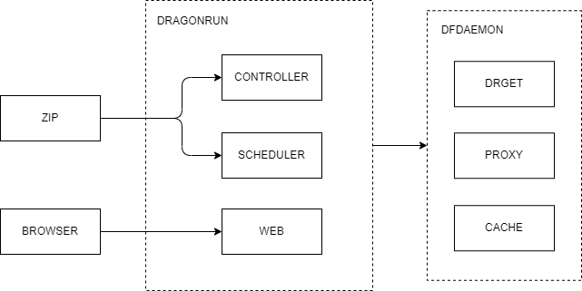

# deploy

## Introduction

*deploy* is the deployment of [dragonrun](https://github.com/dragonrun).

## Diagram

## Flow

## Deploy

## CLI

## License

Project License can be found [here](LICENSE).

## Reference

- [conflux](https://github.com/transcend-io/conflux)
- [dragonfly](https://d7y.io/)
- [node-unzip](https://github.com/EvanOxfeld/node-unzip)
- [python-zipstream](https://github.com/allanlei/python-zipstream)
- [sunzip](https://github.com/madler/sunzip)
- [zip-spec](https://pkware.cachefly.net/webdocs/casestudies/APPNOTE.TXT)
- [zipstream](https://github.com/krolaw/zipstream)
- [zipstreamer](https://github.com/scosman/zipstreamer)
